# OilGasProject


Дашборд для мониторинга добычи нефти и газа в реальном времени.
Включает 3D/2D‑визуализацию скважин, интерактивные графики, таблицу с фильтрацией и виртуализацией,
а также экспорт данных в Excel и PDF.

## Интерфейс приложения

### Обзор и табличные данные
| Главная страница | Сводная таблица |
| :---: | :---: |
| 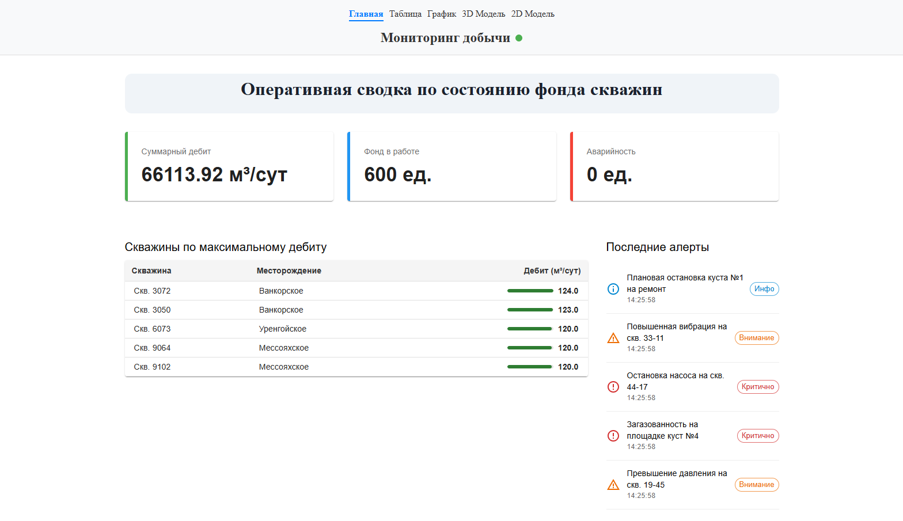 | 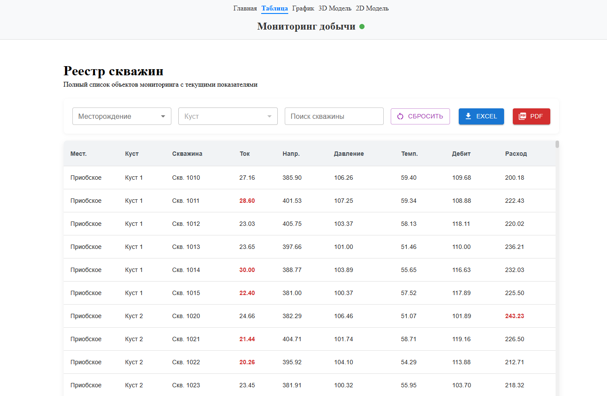 |

### 2D-карта месторождения
| Общий вид карты | Мнемосхема куста |
| :---: | :---: |
| 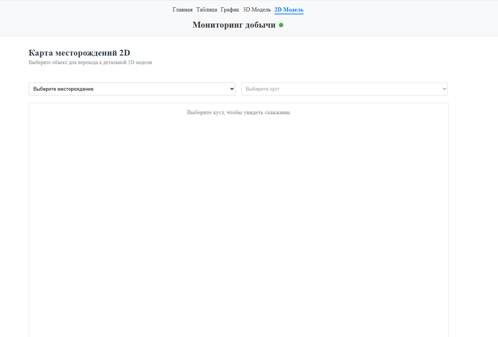 | 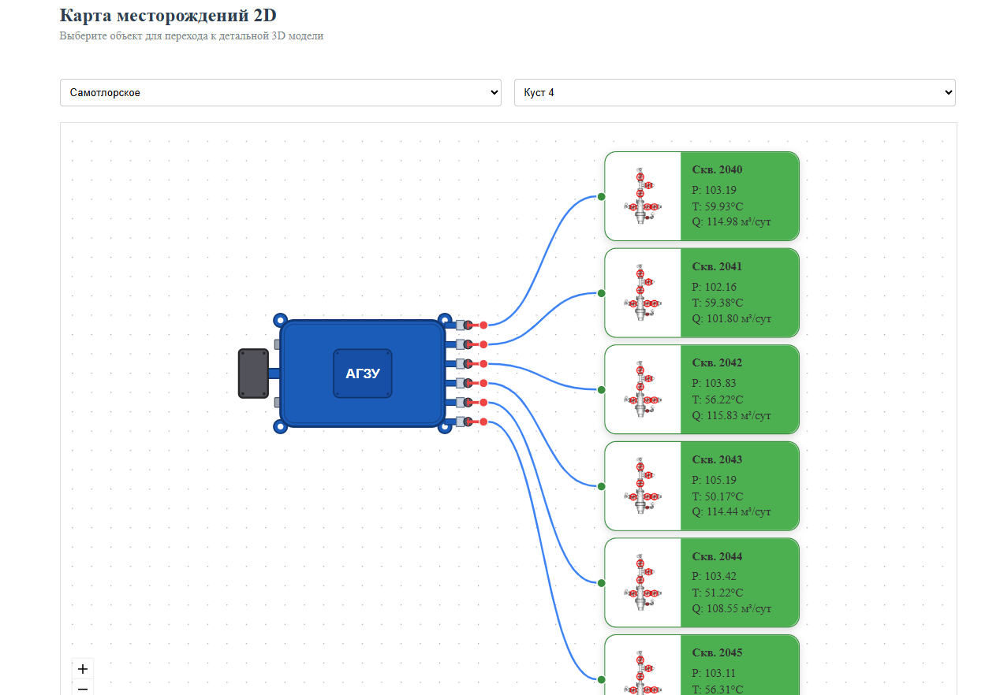 |
| **Параметры скважины** | |
| 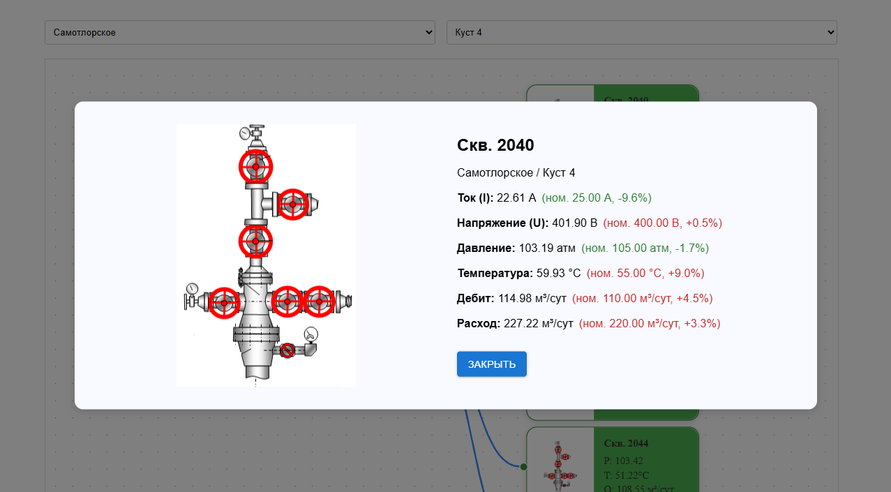 | |

### 3D-визуализация скважин
| Обзорная модель | Просмотр слоев |
| :---: | :---: |
| 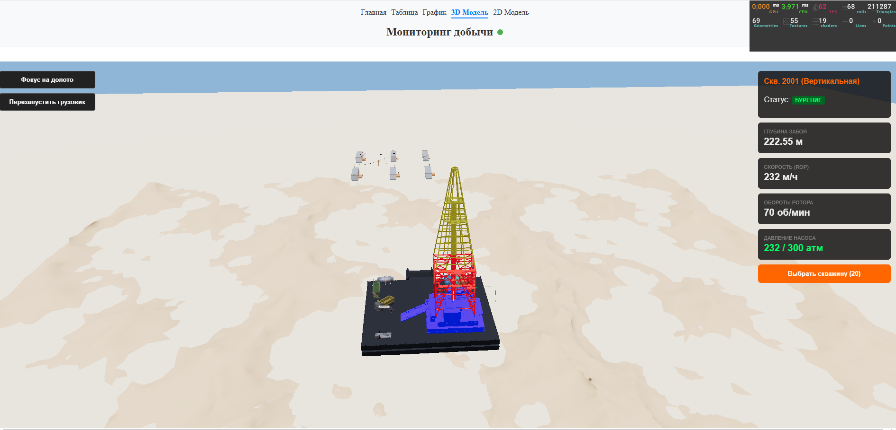 | 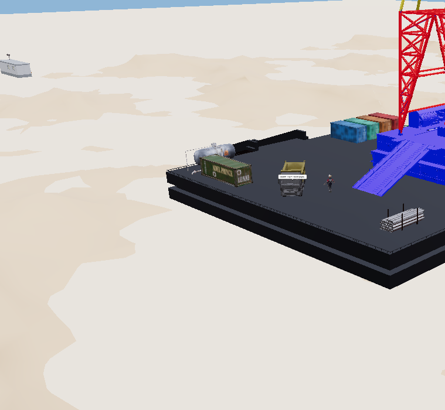 |
| **Управление отображением** | **Панель телеметрии** |
| 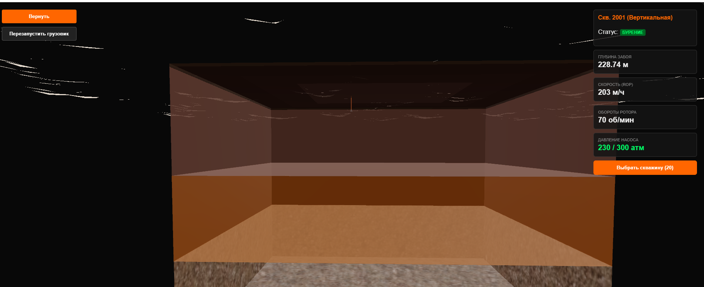 | 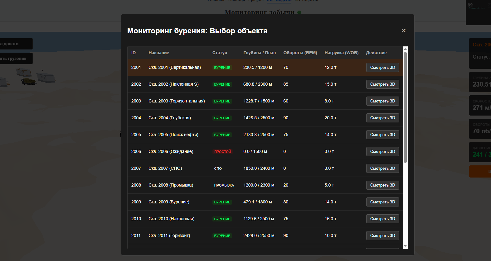 |

### Графики и аналитика
| График добычи | Динамика показателей бурения |
| :---: | :---: |
| 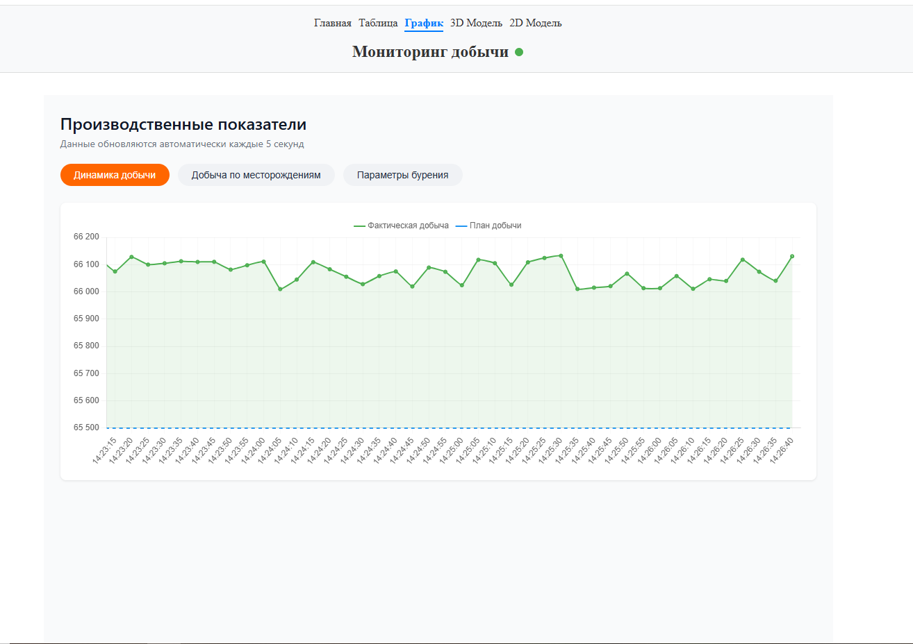 | 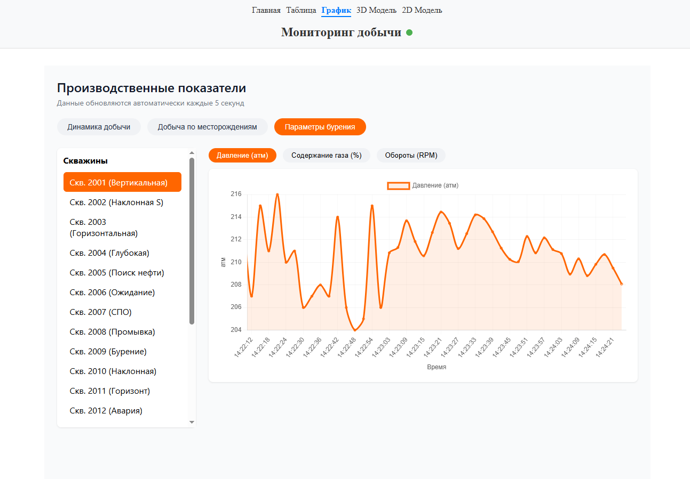 |

---

## Технологический стек

- **Язык:** TypeScript  
- **Фреймворк:** React 19  
- **Стейт-менеджмент:** Redux Toolkit, RTK Query  
- **3D‑визуализация:** Three.js, React Three Fiber  
- **2D-карта месторождения:** @xyflow/react  
- **Графики:** Chart.js, react-chartjs-2  
- **Таблица:** TanStack Virtualizer, Material-UI  
- **Сборка:** Vite  
- **Тестирование:** Vitest (опционально)  
- **Качество кода:** ESLint, Prettier, Husky, lint-staged  
- **CI/CD:** GitHub Actions  

## Архитектура системы

Проект построен по методологии **Feature‑Sliced Design (FSD)**.
Основные слои:

- `app/` – точка входа, роутинг, глобальные стили, Redux-стор
- `pages/` – страницы приложения
- `widgets/` – крупные UI‑блоки: таблица, график, 3D‑визуализатор, 2D‑карта
- `features/` – бизнес‑фичи (экспорт в Excel/PDF, авторизация)
- `entities/` – бизнес‑сущности (скважина, пользователь)
- `shared/` – переиспользуемые модули: UI‑компоненты, API‑клиент, типы, утилиты

Проект состоит из двух частей, которые должны работать одновременно:
1. **Frontend (этот репозиторий):** React-приложение дашборда.
2. **[Mock Server](https://github.com/ArmanTymen/oilLocalServer.git):** Локальный Node.js сервер, эмулирующий REST API и WebSocket-соединения для стриминга данных реального времени.

## Основные возможности

- **3D‑визуализатор стволов скважин** с наложенными данными телеметрии (глубина, RPM, давление, статус бурения).  
  Адаптив:  
  - десктоп — полный 360° с OrbitControls  
  - планшет — touch‑управление (один палец – панорамирование, два – вращение/масштаб), упрощённый HUD  
  - мобильные устройства — 2D‑схема на Canvas с выбором скважины и цветовой индикацией статуса  
- **График добычи** с обновлением в реальном времени (Chart.js + WebSocket), поддержка зума и панорамирования (chartjs-plugin-zoom), отображение отклонения факта от плана  
- **Таблица на 500+ скважин** с фильтрацией по месторождению/кусту, глобальным поиском, сортировкой и виртуализацией (TanStack Virtualizer), подсветкой отклонений от номинала  
- **2D‑карта месторождения** (@xyflow/react) — кластеры (АГЗ) и узлы скважин (ФА), выбор куста, детальная модалка с параметрами  
- **Экспорт данных** в Excel и PDF через Web Workers, с автошириной столбцов и условным форматированием  
- **Адаптивный интерфейс** (Material-UI), поддержка мобильных устройств и планшетов  

## Качество кода

- **ESLint** – статический анализ кода
- **Prettier** – автоматическое форматирование
- **Husky** – запуск линтеров перед коммитом
- **lint-staged** – проверка только изменённых файлов
- **GitHub Actions** – автоматическая проверка типов, линтинг и сборка при пуше в `main` и `dev`

### Шаг 1. Запуск Mock Server

```bash
git clone https://github.com/ArmanTymen/oilLocalServer.git OilGasProjectMockServer

cd OilGasProjectMockServer

npm install

npm run start
```

После запуска сервер будет доступен по адресу:

```text
http://localhost:3001
```

### Шаг 2. Запуск Frontend Dashboard

Откройте новое окно терминала и перейдите в директорию фронтенд-проекта.

```bash
npm install

npm run dev
```

После запуска приложение будет доступно по адресу:

```text
http://localhost:5173
```

### Production-сборка

```bash
npm run build

npm run preview
```